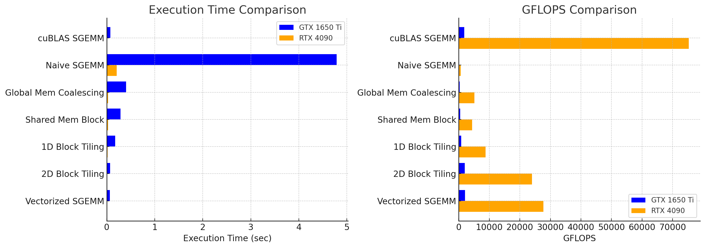
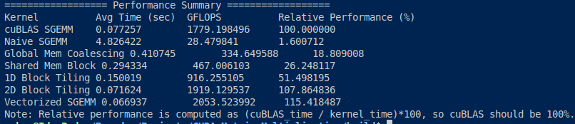
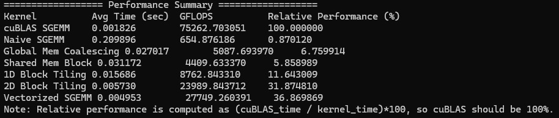

# Blazing_CUDA_SGEMM

This project is a collection of CUDA-based SGEMM (Single-Precision General Matrix Multiply) implementations. It compares several custom kernel implementations with the highly optimized cuBLAS routine, allowing you to explore different optimization techniques and see how they perform on various GPUs.

## Overview

The SGEMM operation computes the matrix multiplication:
\[
C = (α * A * B) + (β * C)
\]
where \(A\), \(B\), and \(C\) are matrices, and \(alpha\) and \(beta\) are scalar values.

This project implements multiple versions of SGEMM:
- **cuBLAS SGEMM:** Uses NVIDIA’s cuBLAS library as a reference.
- **Naive SGEMM:** A straightforward kernel with one thread per output element.
- **Global Memory Coalescing:** A kernel that focuses on improving the coalescing of global memory accesses.
- **Shared Memory Block:** Uses shared memory to load sub-blocks (tiles) of matrices for higher data reuse.
- **1D Block Tiling:** Implements tiling in one dimension to improve cache reuse.
- **2D Block Tiling:** Uses two-dimensional tiling for better workload balance and memory reuse.
- **Vectorized SGEMM:** Uses vectorized memory accesses (e.g., loading `float4` values) to improve memory throughput.

## Performance Comparison

Below are performance results comparing execution time and GFLOPS on two different GPUs: NVIDIA GTX 1650 Ti and RTX 4090.



The 4090 is about 41x faster in cuBLAS SGEMM.(And can be more faster after tuning the kernel more)

Here are the raw results:




## Challenges Faced

Memory Bandwidth Limitations: The GTX 1650 Ti suffered from bandwidth bottlenecks, limiting performance scaling.

Lack of Tensor Core Support: Unlike RTX 4090, the GTX 1650 Ti lacks tensor cores, restricting certain performance optimizations(cleary observable when using cuBLAS).

Efficient Shared Memory Usage: Managing shared memory size and avoiding bank conflicts required fine-tuning.

Kernel Launch Configurations: Optimizing grid and block sizes was crucial to fully utilize GPU resources.

## Build Instructions

This project uses CMake to manage the build process.

### Prerequisites

- NVIDIA GPU with CUDA support.
- CUDA Toolkit.
- CMake (version 3.8 or later).
- Current implementations have only been tested on Ubuntu 22.04.5

### Steps

   ```bash
   mkdir build
   cd build
   cmake
   make
   ./sgemm
   ```

The program will:

Perform 5 warmup runs for each kernel to overcome initial overhead.
Execute 20 benchmark runs per kernel.
Report the average runtime, achieved GFLOPS, and the performance relative to the cuBLAS implementation.

## TODO

### Implement the following kernels:
1. > [Implementations from siboehm's worklog](https://siboehm.com/articles/22/CUDA-MMM)
2. > [Implementations from Lei Mao's blog](https://leimao.github.io/article/CUDA-Matrix-Multiplication-Optimization/#Implementation-with-2D-Block-Tiling-and-2D-Thread-Tiling)
3. > [Implementations from salykova's blog](https://salykova.github.io/sgemm-gpu)

## The sole purpose of this project was to check how far I can push the limits of my GPU and learn along the way. Thanks to the awesome people I have mentioned above and people from GPU MODE, I was able to understand and implement these kernels.
